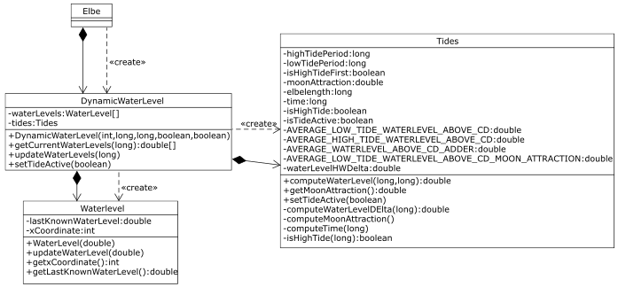
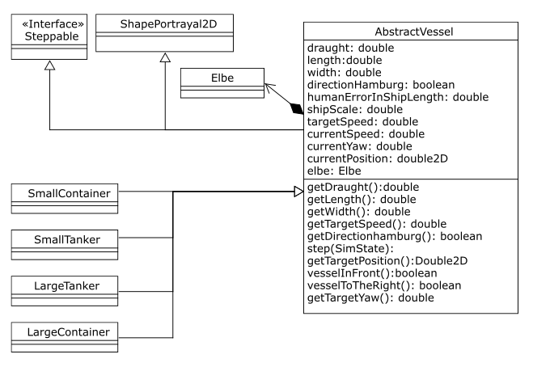
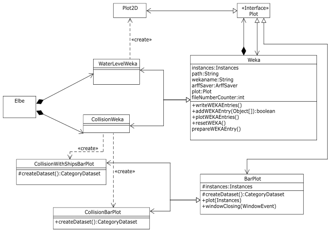

# Elbe Simulation
This is a simulation of the maritime traffic on the Elbe river between Hamburg and the north sea.

A focus is set on the subject of collision detection and avoidance with respect to the planned fairway extension.

The simulation is based on the [MASON simulation framework](http://cs.gmu.edu/~eclab/projects/mason/). [Weka](http://www.cs.waikato.ac.nz/ml/weka/) is used for the evaluation and data visualization.

## Quickstart
* Build with Maven: ```mvn clean install```
* Run executable jar: ```target/supermarket-2.0-with-dependencies.jar```

__Developed by__ Jan Dirk Bischoff, Alexander Eguchi, Adrian Jagusch, Hendrik Kahlen and Jannik Spieker

## UML Diagrams




